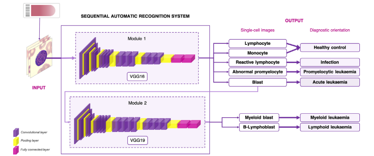
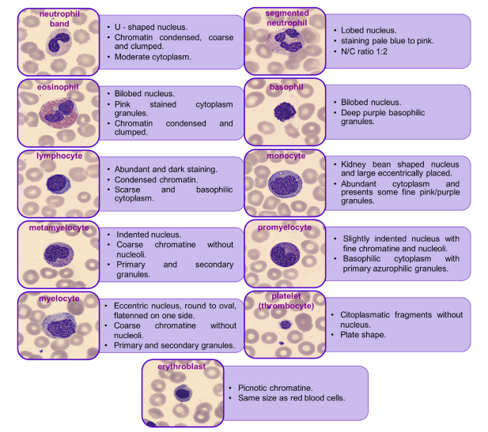
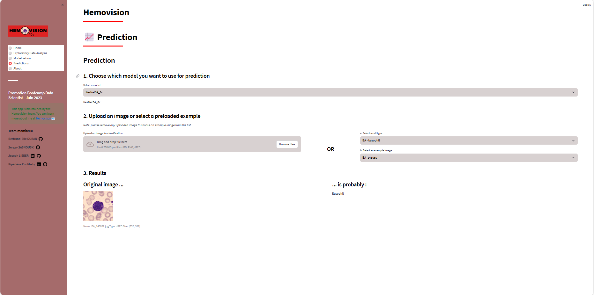

# Hemovision     
Automated blood cells classification for diagnosis and research

## Presentation and Installation

This repository contains the code for our project **Blood cells classification**, developed during our [Data Scientist training](https://datascientest.com/en/data-scientist-course) at [DataScientest](https://datascientest.com/).

The goal of this project is to to identify the different types of blood cells using computer vision algorithms. The density and relative abundance of blood cells in the smear is crucial for the diagnosis of many pathologies, such as leukemia, which relies on the ratio of lymphocytes. The identification of abnormal leukocytes in pathologies such as leukemia could complete this first part.
Developing a tool capable of analyzing cells from blood smears could facilitate the diagnosis of certain pathologies, but could also be used for research purposes.
<br/>


  Models             |  Blood cells
:-------------------------:|:-------------------------:
  |  

<!--- image source : ACEVEDO, A., S. ALFÉREZ, A. MERINO, L. PUIGVÍ, AND J. RODELLAR. (2019): “Recognition of 
peripheral blood cell images using convolutional neural networks,” Computer methods 
and programs in biomedicine, 180, 105020. -->

<br/>

This project was developed by the following team :

- Bertrand-Elie DURAN ([GitHub](https://github.com/eliebd/))
- Sergey SASNOUSKI ([GitHub](https://github.com/ssasnouski/) / [LinkedIn](http://linkedin.com/))
- Joseph LIEBER ([GitHub](https://github.com/josephlieber75/) / [LinkedIn](https://www.linkedin.com/in/joseph-lieber-687878a6/))
- Kipédène COULIBALY ([GitHub](https://github.com/KipedeneCoulibaly/) / [LinkedIn](https://www.linkedin.com/in/kip%C3%A9d%C3%A8necoulibaly/))

You can browse and run the the modeling report and EDA [notebooks](./notebooks). 

You will need to install the dependencies (in a dedicated environment) to be able to run the application locally :

```
pip install -r requirements.txt
```

## Hemovision App

- Install streamlit.   
- On the "predictions" page, choose your model (8 classes or 11 classes, see the modeling report for details).
- Import your own image or choose from the images provided.   
NB: the result may take up to 8 or 9 seconds to be displayed.

To run the app (be careful with the paths of the files in the app):

```shell
conda create --name my-awesome-streamlit python=3.9
conda activate my-awesome-streamlit
pip install -r requirements.txt
streamlit run app.py
```

The app should then be available at [localhost:8501](http://localhost:8501).


